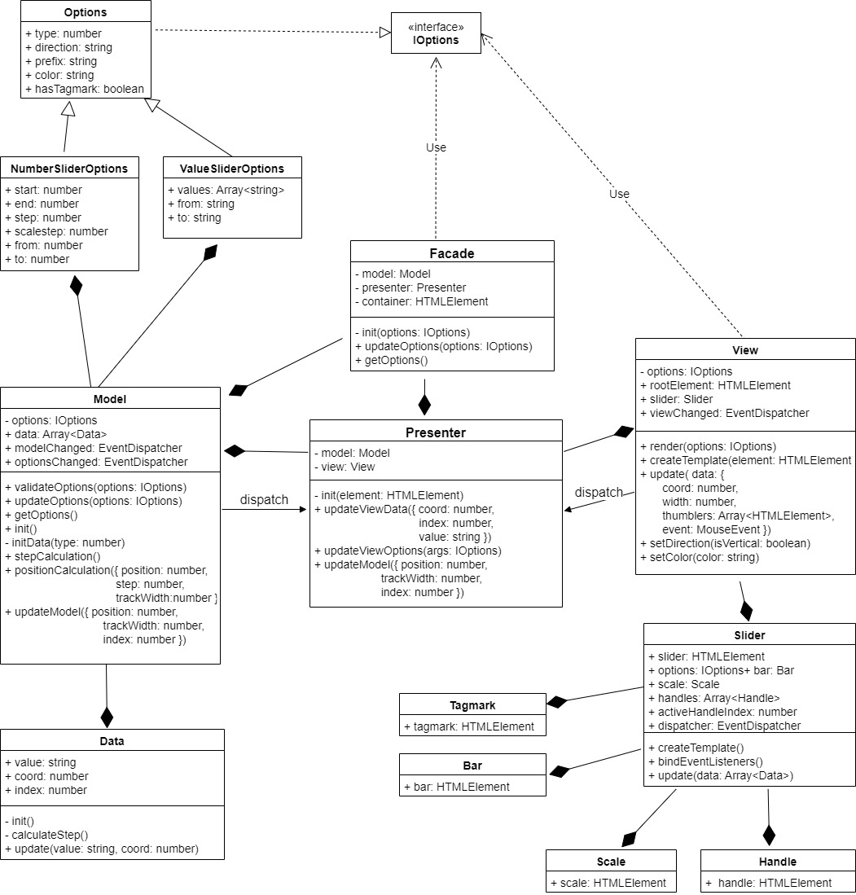

# PerfectSlider

Слайдер, плагин для jQuery

## Demo
[Demo page](https://yubil-olga.github.io/Range/dist/index.html)

## Использование

Совместимая версия Node.js v10.16.0   
Для работы слайдера необходима библиотека jQuery 3.5.1.

### Установка

1. **git clone** https://github.com/Yubil-Olga/Range - клонировать репозитрорий
2. **npm install** - установить зависимости
3. **npm run build** - запустить сборку
4. **npm test** - запуск тестов
5. **npm run dev** - запустить сборку в режиме development
6. **npm start** - запустить webpack-dev-server
7. **npm run lint** - запустить линтер

### Инициализация

Необходимо подключить perfectSlider.js и perfectSlider.min.css

```
<link rel = 'stylesheet' href = 'perfectSlider.min.css'>
```
```
<div class='myElement'></div>
```
```javascript
import 'perfectSlider.js';

$(() => {
  $(".myElement").perfectSlider();
})
```

#### Подключение опций:
```javascript
$('.myElement').slider({
	type: 'double',
    direction: 'vertical',
    values: ['one', 'two', 'three']
});
```
Параметры можно также передавать с помощью data-атрибутов:
```
<div class='myElement' data-is-range='true' data-start='-80'></div>
```


### Настройки
| Option      | Defaults | Type             | Description                                                                     |
| ----------- |:--------:|:----------------:|---------------------------------------------------------------------------------|
| isVertical  | false    | boolean          | Choose slider direction                       |
| isRange     | false    | boolean          | Choose slider type, could be single - for one handle, or double for two handles |
| start       | 0        | number           | Set slider minimum value
| end         | 100      | number           | Set slider maximum value
| step        | 1        | number           | Set sliders step
| scalestep   | -        | number           | Creates scale of the slider, set step of scale
| prefix      | -        | string           | Set prefix for values
| color       | #53b6a8  | string           | Set actve color, could be gradient
| tagmark     | true     | boolean          | Set tagmark
| values      | []       | array            | Set your own array of possible slider values. They should be strings.
| from        | -        | number           | Set position of first handle, if this slider is range
| to          | 1        | number or string | Set position of handle  |

* * *
## Методы

**Получить текущие параметры слайдера:**

Возвращает объект jQuery
```
const $options = $(".myElement").perfectSlider('getOptions');
const options = $options.get(0);
```
**Передать параметры и обновить слайдер:**
```
$(".myElement").perfectSlider('setOptions', { isVertical: true, });
```
**Подписаться на обновления слайдера:**   
   
this.$slider.perfectSlider('subscribe', callback)

```
this.$slider.perfectSlider('subscribe', (options: IOptions) => {
  /*
    Ваш код
  */
});
```
**Отписаться от обновлений слайдера:**
```
this.$slider.perfectSlider('unsubscribe', callback)
```
## Архитектура приложения

**View** - отвечает за внешнее представление слайдера, отрисовывает его в Dom. Пользователь взаимодействует непосредственно с View с помощью событий мыши. Как только произошло указанное событие, Presenter получает уведомление (inputChanged).

**Model** - хранит данные о выбранных значениях(_data). Может получить команду от презентера, что данные необходимо пересчитать(valueCalculation). Пересчитывает, обновляет _data и отчитывается перед презентером: modelChanged.

**Presenter** - посредник между View и Model. Слушает события: если inputChanged, вызывает метод модели valueCalculation и передает необходимые для расчета данные. Если modelChanged, то вызывает метод вида слайдера update и передает ему значения и координаты для перерисовки.

## UML диаграмма
